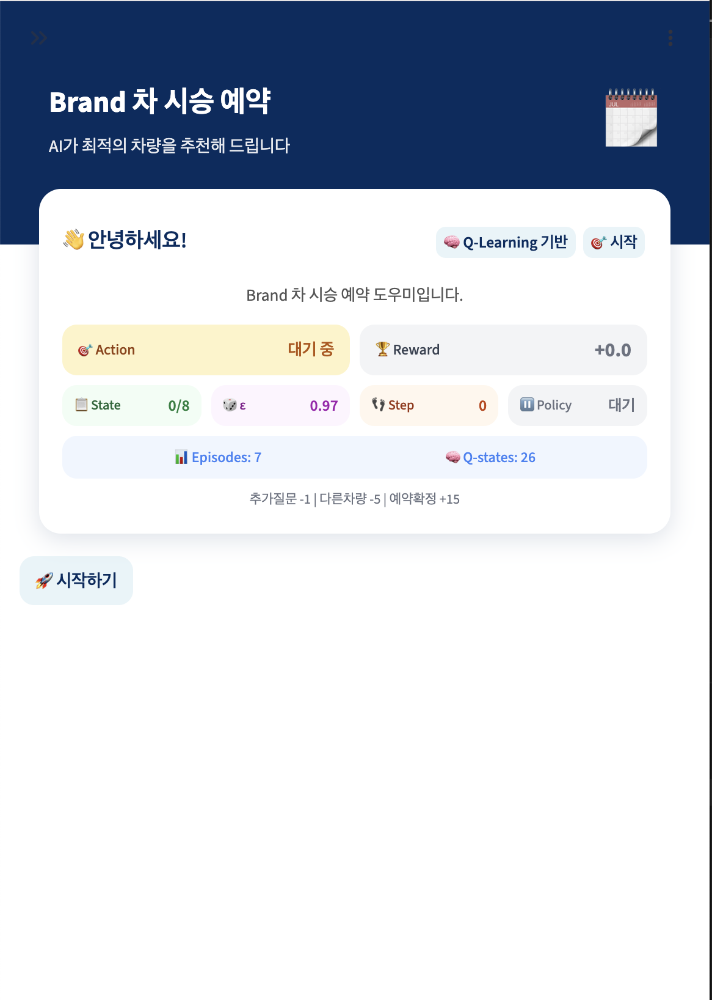
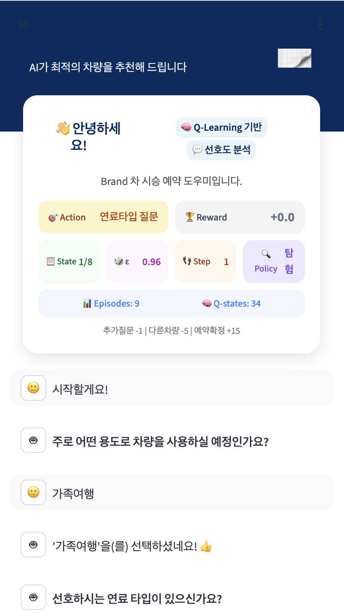
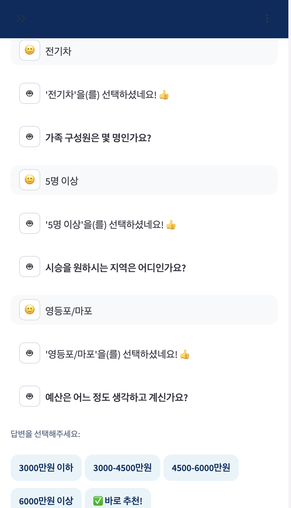
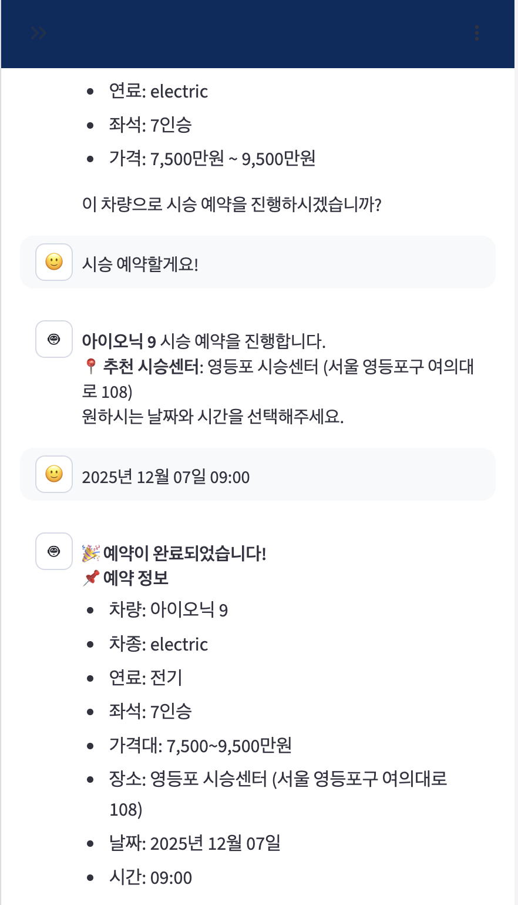

# 강화학습 프로젝트: 자동차 시승 예약 통합 시스템

> **Interactive Conversational Recommendation System using Reinforcement Learning**

---

## 💡 연구 동기

### "20 Questions" 게임에서 자동차 업무 도메인으로

본 프로젝트는 EMNLP 2018에 발표된 **"Playing 20 Question Game with Policy-Based Reinforcement Learning"** (Hu et al., 2018)[arXiv:1808.07645](https://arxiv.org/abs/1808.07645) 논문에서 영감을 받아, 학술적 게임 환경의 강화학습 기법을 **실제 자동차 업무 도메인에 적용**한 연구임.

#### 원 논문의 핵심 아이디어

| 구분 | 20 Questions 게임 |
|------|-------------------|
| **목표** | 최대 20개 질문으로 사용자가 생각한 물체(유명인, 동물 등) 맞추기 |
| **방법** | 정책 기반 강화학습으로 최적의 질문 선택 정책 학습 |
| **핵심 기여** | 노이즈 있는 답변에 강건, 객체 데이터베이스 의존성 제거 |

#### 본 프로젝트의 확장

원 논문의 "질문을 통한 정보 수집 → 최종 추론" 프레임워크를 **자동차 시승 예약 도메인**에 확장 적용함:

| 구분 | 20 Questions 게임 | 시승 예약 시스템 (본 프로젝트) |
|------|-------------------|-------------------------------|
| **환경** | 게임 환경 | 실제 업무 환경 (차량 DB, 센터 스케줄) |
| **목표** | 물체 맞추기 | 최적 차량 추천 + 일정 배정 |
| **질문 수** | 최대 20개 | **필수 4개 + 선택 4개** (효율성 강조) |
| **보상** | 정답 여부 | 고객 만족도 + 예약 성사 - 질문 수 |
| **확장** | 단일 Phase(파이프라인) | **Two-Phase** (차량 추천 + 일정 스케줄링) |

#### 연구적 기여

1. **도메인 적용**: 학술적 게임 환경 → 실제 비즈니스 프로세스
2. **효율성 강화**: 20개 질문 → **필수 4개 질문 + 선택 4개 질문**으로 목표 달성
3. **파이프라인 확장**: 정보 수집 → 추천 → **스케줄링까지 End-to-End 통합**
4. **시너지 최적화**: Phase 간 협업 효과를 Synergy Bonus로 정량화

---

## 📱 실행 결과 (Mobile App Demo)

### 모바일 최적화 대화형 추천 시스템

학습된 Q-Learning 모델을 **모바일 친화적 UI**로 구현하여 실시간 대화형 추천 시스템을 제공함.

> 🎯 **모바일 앱 특징**: 터치 기반 인터페이스, 반응형 디자인, 실시간 MDP 상태 시각화

<p align="center">
  
  
</p>
<p align="center">
  
  
</p>

| 단계 | 화면 | 설명 |
|------|------|------|
| **1. 시작** | 좌측 상단 | MDP 상태 시각화 (Action, Reward, State, ε, Step, Policy) |
| **2. 질문** | 우측 상단 | 필수 질문 4개 수집, ε-greedy Policy 표시 |
| **3. 추천** | 좌측 하단 | 고객 응답 기반 최적 차량 추천, 상세 정보 표시 |
| **4. 완료** | 우측 하단 | 지역 기반 시승센터 매칭, 예약 확정 (Reward +15) |

### MDP 시각화 요소

| 요소 | 설명 | 표시 예시 |
|------|------|-----------|
| 🎯 **Action** | 현재 수행 중인 행동 | 용도 질문, 차량 추천, 예약 완료 |
| 🏆 **Reward** | 누적 보상 | +15.0 (예약 성공 시) |
| 📋 **State** | 질문 진행률 | 4/8 (4개 질문 완료) |
| 🎲 **ε** | 탐험률 | 0.05 (학습 후) |
| 👣 **Step** | 에피소드 스텝 | 6 |
| 🔍/🎯 **Policy** | 탐험/활용 모드 | 활용 (Q값 기반 선택) |

### 핵심 성과

| 지표 | 결과 |
|------|------|
| **평균 질문 수** | 4개 (필수) + α (선택) |
| **예약 완료 Reward** | +15.0 |
| **모델 동기화** | 5 에피소드마다 자동 저장 |
| **실시간 학습** | 챗봇 사용 시 Q-table 업데이트 |

---

## 📋 프로젝트 개요

자동차 브랜드 홈페이지의 시승 예약 과정에서 고객이 겪는 번거로움을 **강화학습 기반 대화형 추천 시스템**으로 해결함.

> 📱 **모바일 앱으로 구현**: Streamlit 기반 반응형 웹앱으로 모바일 환경에서 최적화된 사용자 경험 제공

### 강화학습 관점의 문제 정의

본 프로젝트는 **Agent-Environment 상호작용** 구조로 설계됨.

- **Environment**: 고객(응답자), 차량 데이터베이스(재고), 시승 센터 상태(스케줄)로 구성
- **Agent**: 강화학습 기반 의사결정 주체
- **State**: 고객 응답 히스토리, 후보 차량 목록, 센터 가용 상태
- **Action**: 질문 선택, 차량 추천, 일정 배정
- **Reward**: 고객 만족도 + 예약 성사 - 질문 수 - 대기시간

### Two-Phase Hybrid System

본 시스템은 **강화학습 + 규칙 기반 하이브리드** 구조로 설계됨.

- **Phase 1 (Recommendation Agent)**: Q-Learning 기반, 최소 질문으로 최적 차량 추천
- **Phase 2 (Scheduling Agent)**: 하이브리드 방식
  - 고객 응대: 질문 기반 (규칙) - 선호 일정 수집
  - 센터 최적화: DQN 기반 - 자원 배분 및 대안 제시 최적화

두 Phase는 순차적으로 실행되며, Phase 1의 추천 결과가 Phase 2의 입력으로 전달됨.

### 학습 목표

Agent가 학습을 통해 스스로 터득해야 하는 것:

1. 어떤 질문이 고객 선호 파악에 효과적인가?
2. 몇 개의 질문 후 추천해야 정확도와 효율의 균형이 맞는가?
3. 어떤 차량을 추천해야 고객 만족도가 높은가?
4. 어떤 시간대에 배정해야 고객과 센터 모두 만족하는가?

### 차별화 포인트

1. **대화형 추천**: 단순 필터링이 아닌 Sequential Decision Making 기반 추천
2. **Two-Phase 통합**: 추천과 스케줄링을 연결한 실용적 시스템
3. **시뮬레이션 환경**: 도메인 지식 기반 현실적인 고객·센터 시뮬레이션

### 구현 범위

- **분석 대상**: Hyundai, Kia, Genesis 3개 브랜드 시승 예약 프로세스
- **구현 대상**: **Hyundai** 브랜드 기준으로 구현 (7단계 프로세스 → 2단계로 단순화)
- **확장성**: 차량 DB와 질문셋만 교체하면 다른 브랜드에도 적용 가능한 구조로 설계

---

## 🚨 현재 문제

### 브랜드별 시승 예약 프로세스 분석

| 브랜드 | 단계 수 | 주요 단계 |
|--------|---------|-----------|
| **Hyundai** | 7단계 | 모델 → 장소 → 방법 → 일정 → 운전경력 → 보유차종 → 요청사항 |
| **Genesis** | 5단계 | 차량 → 드라이빙라운지 → 일정 → 유의사항 → 확인 |
| **Kia** | 7단계 | 모델 → 거점 → 방법 → 일정 → 동의 → 시승자 → 설문 |

> 📁 실제 화면 캡처: `resource/image/brand/` 참조

### 고객의 번거로움 (Pain Points)

1. **차량 선택의 어려움**: 수십 개 모델 중 어떤 차가 나에게 맞는지 모름
2. **복잡한 단계**: 5~7단계를 모두 직접 입력해야 함
3. **일정 선택의 불편함**: 캘린더에서 가능한 시간대를 직접 확인 필요
4. **정보 입력 반복**: 운전경력, 보유차종 등 매번 입력

### 강화학습으로 해결

```
AS-IS: 고객이 모든 것을 직접 선택 (5~7단계)
         ↓
TO-BE: AI가 최소 질문으로 추천 + 최적 일정 자동 배정 (2단계)
```

- **Phase 1**: 4개 필수 질문으로 최적 시승 차량 추천
- **Phase 2**: 고객 선호 시간 + 센터 가용 상황 고려하여 최적 일정 자동 배정

---

## 🤖 왜 강화학습인가?

### 단순 추천 vs 대화형 추천

| 구분 | 단순 추천 | 대화형 추천 (본 프로젝트) |
|------|-----------|---------------------------|
| 방식 | 프로필 → 즉시 추천 | 질문 → 응답 → 질문 → ... → 추천 |
| 적합 알고리즘 | Collaborative Filtering, Rule-based | **강화학습 (RL)** |
| 의사결정 | 1회성 | **Sequential Decision Making** |

### 대화형 추천의 RL 적합성

본 프로젝트는 **"20 Questions" 게임**과 유사한 구조를 가짐:

```
Agent: "주로 어떤 용도로 사용하세요?"     ← Action 1: 질문 선택
고객: "출퇴근이요"                        ← 환경 응답 (State 변화)
Agent: "가족은 몇 명이세요?"              ← Action 2: 추가 질문 or 추천?
고객: "4명이요"                           ← 환경 응답 (State 변화)
Agent: "싼타페 하이브리드 추천드립니다"    ← Action 3: 추천 결정
고객: "마음에 들어요!" (만족도 80%)        ← Reward 발생
```

### RL이 학습하는 것

| 학습 목표 | 설명 |
|-----------|------|
| **질문 최소화** | 몇 개의 질문으로 정확히 추천할 수 있는지 |
| **질문 순서 최적화** | 어떤 질문이 정보량(Information Gain)이 높은지 |
| **추천 타이밍** | 언제 질문을 멈추고 추천해야 하는지 |
| **Exploration-Exploitation** | 새로운 질문 전략 탐색 vs 검증된 전략 활용 |

### 강화학습 적용의 핵심 요소

| 요소 | 자율주행 | 대화형 추천 (본 프로젝트) |
|------|----------|---------------------------|
| Sequential Decision | ✅ 연속 제어 | ✅ 질문 → 질문 → 추천 |
| Delayed Reward | ✅ 목적지 도착 | ✅ 추천 후 만족도 확인 |
| State Transition | ✅ 차량 위치 변화 | ✅ 고객 응답으로 정보 축적 |
| Exploration-Exploitation | ✅ 새 경로 탐색 | ✅ 더 질문할지 vs 바로 추천할지 |

---

## 🎯 MDP 설계

상세 State, Action, Reward 설계는 [MDP_DESIGN.md](./docs/MDP_DESIGN.md) 참조.

---

## 🏗️ 시스템 아키텍처

```
고객 웹사이트 접속
        |
        v
+---------------------------------------+
|   Phase 1: 시승 차량 추천             |
|   - Q-Learning                        |
|   - State: 고객 프로필                |
|   - Action: 질문 또는 추천            |
+---------------------------------------+
        |
        v (추천 차량 목록)
+---------------------------------------+
|   장소 선택 (규칙 기반)               |
|   - 위치 권한 O -> GPS 기반           |
|   - 위치 권한 X -> 지역 질문          |
+---------------------------------------+
        |
        v (선택된 대리점)
+---------------------------------------+
|   Phase 2: 스케줄링 (하이브리드)      |
+---------------------------------------+
|   [고객 응대] 규칙 기반               |
|   - 선호 일정 질문 -> 가용성 확인     |
+---------------------------------------+
|   [센터 최적화] DQN 기반              |
|   - 자원 배분 최적화                  |
|   - 대안 제시 전략 학습               |
+---------------------------------------+
        |
        v
최종 스케줄 + 예약 확정
```

### 단계별 역할

| 단계 | 목적 | 방식 |
|------|------|------|
| **Phase 1** | 최적 차량 추천 | Q-Learning (시뮬레이션 학습) |
| **장소 선택** | 시승 대리점 선택 | 규칙 기반 (GPS 또는 질문) |
| **Phase 2** | 일정 수집 + 센터 최적화 | 하이브리드 (규칙 + DQN) |

### Phase 1 목적 및 구조

Phase 1은 **시뮬레이션 기반 학습**을 통해 최적의 질문 전략을 학습한 모델을 생성하는 것이 목적임.

#### 왜 시뮬레이션인가?

| 방식 | 장점 | 단점 |
|------|------|------|
| 실제 고객으로 학습 | 실제 데이터 | 수천 번 시행착오 → 고객 경험 악화 |
| **시뮬레이션으로 학습** | 빠른 탐색, 무한 반복 가능 | 시뮬레이터 품질에 의존 |

#### Training vs Deployment

```
+------------------------------------------------------------------+
|  Training Phase (현재 구현)                                      |
+------------------------------------------------------------------+
|  1. 시뮬레이션 고객 생성 (랜덤 프로필: 예산, 가족 수 등)         |
|  2. Agent가 질문 선택 (e-greedy 탐험)                            |
|  3. Environment가 고객 대신 자동 응답 (숨겨진 선호도 기반)       |
|  4. Agent가 차량 추천                                            |
|  5. Environment가 Reward 자동 계산 (매칭 점수 기반)              |
|  6. Q-table 업데이트 -> 1000+ 에피소드 반복                      |
+------------------------------------------------------------------+
                            |
                            v 학습된 모델 저장
+------------------------------------------------------------------+
|  Deployment Phase (추후 구현)                                    |
+------------------------------------------------------------------+
|  1. 실제 고객이 질문에 답변                                      |
|  2. 학습된 모델이 최적 질문 선택 (Greedy)                        |
|  3. 학습된 모델이 차량 추천                                      |
|  4. 실제 고객 만족도 피드백 수집                                 |
+------------------------------------------------------------------+
```

#### Phase 1 학습 결과

시뮬레이션 학습을 통해 Agent가 스스로 터득하는 것:

- ✅ 어떤 질문 순서가 효율적인가
- ✅ 몇 개의 질문 후 추천해야 하는가
- ✅ 어떤 상황에서 어떤 차량을 추천해야 하는가

### 장소 선택 (규칙 기반)

시승 대리점 선택은 강화학습이 아닌 **규칙 기반**으로 처리함.

```
+-------------------------------------------------------+
|  고객이 웹사이트 접속                                 |
+-------------------------------------------------------+
                          |
                          v
              +--------------------------+
              |   위치 권한 허용?        |
              +--------------------------+
                 |                  |
            Yes  v                  v  No
    +------------------+  +------------------------------+
    | GPS 기반         |  | 질문: "어느 지역에서        |
    | 주변 대리점      |  |   시승하시겠어요?"          |
    | 자동 추천        |  | (서울/경기/부산/...)        |
    +------------------+  +------------------------------+
                 |                  |
                 v                  v
          +-------------------------------------------+
          |  해당 지역 시승 대리점 목록 제시          |
          |  (거리순 또는 가용 시간 많은 순)          |
          +-------------------------------------------+
```

#### 왜 규칙 기반인가?

- 장소 선택은 **탐색 공간이 작음** (지역 → 대리점)
- 최적화 기준이 **명확함** (거리, 가용성)
- 강화학습의 시행착오가 불필요

### Phase 2 목적 및 구조

Phase 2는 **하이브리드 방식**으로 고객 일정 수집과 센터 자원 최적화를 수행함.

#### 왜 하이브리드인가?

| 구분 | 고객 일정 수집 | 센터 자원 최적화 |
|------|---------------|-----------------|
| 특성 | 고객만 알고 있음 | 복잡한 제약 조건 |
| 최적 방식 | 직접 질문 (규칙) | 학습 기반 (RL) |
| 이유 | 추론 불가능 | 다양한 상황 대응 필요 |

#### Phase 2 전체 흐름

```
+------------------------------------------------------------------+
|  [1] 고객 응대 (규칙 기반)                                       |
+------------------------------------------------------------------+
|  질문: "언제 시승하시겠어요?"                                    |
|  - 선호 날짜 선택 (캘린더 or 이번주/다음주)                      |
|  - 선호 시간대 선택 (오전/오후/저녁)                             |
+------------------------------------------------------------------+
                              |
                              v 고객 선호 일정
+------------------------------------------------------------------+
|  [2] 센터 가용성 확인                                            |
+------------------------------------------------------------------+
|  - 해당 시간대 차량 가용 여부                                    |
|  - 담당 직원 배정 가능 여부                                      |
|  - 기존 예약과 충돌 여부                                         |
+------------------------------------------------------------------+
              |                                |
         가능 v                                v 불가능
+----------------------------+  +-----------------------------------+
|  예약 확정                 |  |  [3] 대안 제시 (DQN 기반)         |
|  - 일정 확정 알림          |  |  - 최적 대안 시간 선택            |
|  - 리마인더 설정           |  |  - 고객 수락률 최대화             |
+----------------------------+  +-----------------------------------+
```

#### 센터 자원 및 제약 조건

```
+------------------------------------------------------------------+
|  시승 센터 자원                                                  |
+------------------------------------------------------------------+
|  - 시승 차량: 모델별 1~2대 (예: 아반떼 2대, 싼타페 1대)          |
|  - 담당 직원: 3~5명 (동시 응대 한계)                             |
|  - 운영 시간: 09:00 ~ 18:00 (1시간 단위 슬롯)                    |
|  - 예약 현황: 일별 예약 밀도 상이                                |
+------------------------------------------------------------------+
```

#### 센터 관점 최적화 (DQN 학습 대상)

| 최적화 목표 | 설명 | Reward |
|-------------|------|--------|
| **대안 제시 전략** | 어떤 대안을 먼저 제시해야 수락률이 높은가 | +수락, -거절 |
| **부하 분산** | 예약이 특정 시간에 몰리지 않게 유도 | +균등 분포 |
| **차량 활용률** | 모든 차량이 골고루 사용되게 | +활용률 |
| **대기열 관리** | 동시 요청 시 우선순위 결정 | +처리량, -대기시간 |

#### 대안 제시 최적화 예시

```
상황: 고객이 "토요일 오전" 원하지만 만석

+------------------------------------------------------------------+
|  가능한 대안들                                                   |
+------------------------------------------------------------------+
|  A. 토요일 오후 2시 (같은 날, 다른 시간)                         |
|  B. 일요일 오전 10시 (다른 날, 같은 시간)                        |
|  C. 금요일 저녁 6시 (평일, 퇴근 후)                              |
|  D. 다음주 토요일 오전 (1주일 후)                                |
+------------------------------------------------------------------+
                              |
                              v
        DQN이 학습하는 것:
        - 고객 유형별 최적 대안 순서
        - 센터 상황별 추천 전략
        - 수락률을 최대화하는 제안 방식
```

#### Phase 2 MDP 설계

**State (상태)**:
```python
state = {
    'customer_preference': {
        'preferred_date': '2024-01-20',      # 고객 선호 날짜
        'preferred_time': 'morning',          # 오전/오후/저녁
        'flexibility': 'medium'               # 유연성 (high/medium/low)
    },
    'center_state': {
        'available_slots': [...],             # 가용 시간 슬롯
        'vehicle_availability': {...},        # 차량별 가용 현황
        'staff_schedule': {...},              # 직원 스케줄
        'pending_requests': 3                 # 대기 중인 요청 수
    },
    'recommended_car': 'santafe_hybrid'       # Phase 1 추천 차량
}
```

**Action (행동)**:
```python
actions = {
    0: 'confirm_booking',           # 예약 확정
    1: 'suggest_same_day_alt',      # 같은 날 다른 시간 제안
    2: 'suggest_next_day_alt',      # 다음 날 같은 시간 제안
    3: 'suggest_weekday_alt',       # 평일 대안 제안
    4: 'suggest_next_week_alt',     # 다음주 제안
    5: 'offer_incentive'            # 비선호 시간대 인센티브 제공
}
```

**Reward (보상)**:
```python
reward = (
    + 10 * booking_confirmed        # 예약 성사
    + 5 * preferred_time_match      # 선호 시간 매칭
    + 3 * alternative_accepted      # 대안 수락
    - 2 * (waiting_time / 30)       # 대기시간 패널티
    + 2 * load_balance_score        # 부하 분산 점수
    - 5 * customer_rejected         # 고객 거절 (이탈)
)
```

#### Training vs Deployment

```
+------------------------------------------------------------------+
|  Training Phase (시뮬레이션)                                     |
+------------------------------------------------------------------+
|  1. 시뮬레이션 센터 상태 생성 (가용 차량, 직원, 예약 현황)       |
|  2. 시뮬레이션 고객 요청 생성 (선호 일정, 유연성)                |
|  3. Agent가 예약 확정 또는 대안 제시                             |
|  4. 시뮬레이션 고객이 수락/거절 응답                             |
|  5. Reward 계산 및 DQN 업데이트                                  |
+------------------------------------------------------------------+
                            |
                            v 학습된 모델 저장
+------------------------------------------------------------------+
|  Deployment Phase (실제 운영)                                    |
+------------------------------------------------------------------+
|  1. 실제 센터 상태 조회 (API 연동)                               |
|  2. 고객이 선호 일정 선택                                        |
|  3. 학습된 모델이 최적 배정 또는 대안 제시                       |
|  4. 예약 확정 및 알림                                            |
+------------------------------------------------------------------+
```

#### Phase 2 학습 결과

시뮬레이션 학습을 통해 Agent가 스스로 터득하는 것:

- ✅ 어떤 대안을 제시해야 고객 수락률이 높은가
- ✅ 센터 자원(차량, 직원)을 효율적으로 배분하는 방법
- ✅ 예약 부하를 균등하게 분산시키는 전략
- ✅ 고객 유형별 최적의 대안 제시 순서

#### DQN 신경망 구조

Phase 2에서 사용하는 DQN(Deep Q-Network) 구조:

```
입력 (159차원) → FC(256) + ReLU → FC(256) + ReLU → 출력 (6 액션)
```

**상태 벡터 (159차원)**:
| 구성 요소 | 차원 |
|-----------|------|
| 고객 선호도 | 6 |
| 슬롯 가용성 | 126 (21일 × 6슬롯) |
| 차량 가용성 | 23 |
| 메타 정보 | 4 |

**하이퍼파라미터**:
| 파라미터 | 값 |
|----------|-----|
| Hidden Dim | 256 |
| Learning Rate | 0.001 |
| γ (Discount) | 0.99 |
| ε-decay | 0.995 |
| Batch Size | 64 |
| Replay Buffer | 10,000 |

**핵심 구성요소**:
- **Q-Network**: 상태 → Q값 예측 (PyTorch `nn.Module`)
- **Target Network**: 안정적인 타겟 Q값 계산 (주기적 동기화)
- **Experience Replay**: 샘플 간 상관관계 제거
- **ε-greedy**: 탐험-활용 균형

---

## 🔗 Phase 3: 통합 시스템

**Phase 3는 Phase 1(차량 추천)과 Phase 2(스케줄링)를 연결하는 End-to-End 파이프라인**입니다. 개별 Phase에서 학습된 Agent들을 통합하여 차량 추천부터 일정 예약까지 전체 프로세스를 하나의 시스템으로 처리함.

### Three-Phase RL System

| Phase | 목적 | 알고리즘 | 상태 |
|-------|------|----------|------|
| **Phase 1** | 최소 질문으로 최적 차량 추천 | Q-Learning | ✅ 완료 |
| **Phase 2** | 고객·센터 만족 일정 배정 | DQN | ✅ 완료 |
| **Phase 3** | End-to-End 통합 최적화 | Phase 1 + Phase 2 + Synergy | ✅ 완료 |

### 통합 시스템 구조

```
고객 입력 → Phase 1 (차량 추천) → Phase 2 (스케줄링) → 예약 확정
```

Phase 1에서 추천된 차량 결과가 Phase 2의 입력으로 전달되어, **차량 추천부터 일정 예약까지 한 번에 처리**하는 End-to-End 파이프라인임.

### 구현 내용

1. **IntegratedSystem 클래스**
   - Phase 1 Agent (Q-Learning)와 Phase 2 Agent (DQN) 연결
   - Phase 1 추천 결과를 Phase 2 입력으로 전달
   - 전체 파이프라인 실행 및 관리

2. **통합 보상 함수**
   ```
   Total_Reward = R1 + R2 + Synergy_Bonus

   R1 (Phase 1): 고객 만족도 + 예약 의향 - 질문 수
   R2 (Phase 2): 예약 성사 + 선호 시간 매칭 - 대기시간
   Synergy_Bonus = 5 × (즉시 예약 가능) + 3 × (추천-스케줄 매칭도)
   ```

3. **End-to-End 평가 메트릭**
   - 전체 예약 성공률 (추천 → 스케줄링 → 확정)
   - 총 상호작용 횟수 (질문 수 + 스케줄링 시도)
   - 고객 만족도 종합 점수
   - 시스템 효율성 (처리 시간, 리소스 활용)

4. **통합 학습 방식**
   - 개별 학습: Phase 1, Phase 2 각각 사전 학습
   - 통합 미세조정: Synergy Bonus로 전체 최적화

### 시너지 효과

| 항목 | 개별 실행 | Phase 3 통합 실행 |
|------|-----------|-------------------|
| 데이터 흐름 | 수동 연결 필요 | 자동 파이프라인 |
| 최적화 | 각 Phase 독립 최적화 | 전체 시스템 최적화 |
| 보상 | R1, R2 개별 계산 | R1 + R2 + Synergy Bonus |
| 추천-스케줄 연계 | 없음 | 즉시 예약 가능 차량 우선 추천 |

### Phase 3 성능 결과 (개선 후)

**학습 조건**: Phase 1 사전학습 1000 에피소드 + Phase 2 사전학습 1000 에피소드 + 통합 학습 1000 에피소드

| 지표 | 기존 | 개선 후 | 변화 |
|------|------|---------|------|
| **총 보상** | 23.84 | **31.98 ± 8.52** | **+34.1%** |
| **End-to-End 성공률** | 83.0% | **89.0%** | +6.0%p |
| **선호 시간 매칭률** | 46.0% | 43.0% | -3.0%p |
| **시너지 보너스** | 4.06 | **10.76** | **+165%** |
| **총 상호작용 횟수** | 2.57회 | 2.57회 | 유지 |

#### 베이스라인 비교

| 방식 | 총 보상 | 성공률 | 개선율 |
|------|---------|--------|--------|
| Random | 14.5 | 76.0% | - |
| Individual (No Synergy) | 18.3 | 84.0% | +26.2% |
| Phase 3 (기존) | 23.9 | 83.0% | +64.8% |
| **Phase 3 (개선)** | **31.98** | **89.0%** | **+120.5%** |

#### 보상 구성 (개선 후)

| 구성 요소 | 평균 보상 | 비율 |
|-----------|-----------|------|
| Phase 1 보상 | 9.84 | 30.8% |
| Phase 2 보상 | 11.38 | 35.6% |
| Synergy 보너스 | 10.76 | **33.6%** |

### Phase 3 개선 사항 (실제 코드에 적용됨)

3가지 개선 방법을 실험하고 **실제 코드에 적용**함:

| 실험 | 방법 | 총 보상 | 개선율 | 적용 |
|------|------|---------|--------|------|
| 기준선 | 기존 Phase 3 | 23.86 | - | - |
| 실험 1 | 하이퍼파라미터 튜닝 | 24.80 | +3.9% | ✅ |
| 실험 2 | 정교한 시너지 보너스 | 30.54 | +28.1% | ✅ |
| **실험 3** | **가용성 정보 활용** | **31.98** | **+34.1%** | ✅ |

**적용된 개선 사항**:
1. **하이퍼파라미터 튜닝**: 에피소드 수 증가 (1000), DQN hidden_dim 256
2. **개선된 시너지 보너스**: 연속적 보상 체계 (최대 17.5점)
3. **가용성 정보 활용**: Phase 1에서 가용 차량 추천 시 보너스 (+2점)

**최종 성능**: Random 베이스라인 대비 **+120.5%** 개선

---

## 🛠️ 기술 스택

- **Python** 3.12+
- **Gymnasium** (OpenAI Gym)
- **PyTorch** (DQN)
- **NumPy, Pandas, Matplotlib, Seaborn**

---

## 📊 평가 지표

| Phase | 지표 | 설명 |
|-------|------|------|
| Phase 1 | 추천 정확도 | 고객 선호도와 추천 차량 매칭 점수 |
| Phase 1 | 질문 효율성 | 평균 질문 수 |
| Phase 2 | 예약 성사율 | 예약 완료 / 전체 요청 |
| Phase 2 | 대안 수락률 | 대안 수락 / 대안 제시 |
| Phase 2 | 선호 시간 매칭률 | 1순위 시간 배정 비율 |
| Phase 2 | 부하 분산 점수 | 시간대별 예약 균등도 |
| 통합 | Total Reward | Episode당 누적 보상 |

---

## 🚀 실행 방법

### 챗봇 실행 (권장)

```bash
# 의존성 설치
uv sync

# 대화형 추천 챗봇 실행
uv run streamlit run src/app/main.py
```

브라우저에서 `http://localhost:8501` 접속하여 사용.

> 📖 Phase 별 학습/평가 명령어는 [실행 가이드](./docs/EXECUTION_GUIDE.md) 참조

---

## 📅 로드맵

상세 구현 일정은 [ROADMAP.md](./docs/ROADMAP.md) 참조.

---

## 🎯 목표 성과

### Phase 1 (차량 추천)
- [x] 시승 차량 추천 정확도 80% 이상
- [x] 평균 질문 수 4개 (필수)
- [x] 베이스라인(Random, Rule-based) 대비 15% 이상 성능 향상

### Phase 2 (스케줄링)
- [x] 예약 성사율 80% 이상 (달성: 81%)
- [ ] 대안 수락률 70% 이상
- [ ] 선호 시간 매칭률 60% 이상
- [x] 베이스라인(Random) 대비 20% 성능 향상 (달성: 23.7%)

### Phase 3 (통합 시스템)
- [x] 전체 예약 성공률 75% 이상 (달성: **89.0%**)
- [x] 총 상호작용 횟수 5회 이하 (달성: **2.57회**)
- [x] 개별 Phase 대비 Synergy Bonus 10% 이상 (달성: **33.6%**)
- [x] Random 베이스라인 대비 20% 이상 성능 향상 (달성: **+120.5%**)

---

## 📂 프로젝트 구조

```
driving-test/
├── README.md
├── requirements.txt
├── data/
│   ├── vehicles.json           # 차량 DB (23종)
│   ├── questions.json          # 질문 목록 (8개)
│   ├── centers.json            # 센터 DB
│   └── customer_profiles.json  # 샘플 고객 데이터
├── src/
│   ├── streamlit_app.py           # Streamlit Cloud 진입점
│   ├── app/
│   │   └── main.py                # 챗봇 메인 앱
│   ├── env/
│   │   ├── recommendation_env.py  # Phase 1 환경
│   │   └── scheduling_env.py      # Phase 2 환경
│   ├── agents/
│   │   ├── q_learning_agent.py    # Phase 1 Agent
│   │   └── scheduling_agent.py    # Phase 2 Agent (DQN)
│   ├── baselines/
│   │   ├── random_baseline.py
│   │   ├── rule_based.py
│   │   └── scheduling_baselines.py
│   ├── utils/
│   │   └── customer_generator.py
│   ├── visualization/
│   │   ├── plot_phase1_results.py # Phase 1 시각화
│   │   └── plot_phase3.py         # Phase 3 시각화
│   ├── train_phase1.py            # Phase 1 학습
│   ├── train_phase2.py            # Phase 2 학습
│   ├── evaluate_phase1.py         # Phase 1 평가 스크립트
│   ├── integrated_system.py       # Phase 3 통합 시스템
│   ├── train_phase3.py            # Phase 3 학습
│   └── evaluate_phase3.py         # Phase 3 평가
├── checkpoints/                   # 학습된 모델 저장
│   ├── standalone/                # 독립 실행용 모델
│   │   └── q_learning_model.json  # Phase 1 Q-Learning 모델
│   ├── chatbot/                   # 챗봇 앱용 모델
│   │   └── chatbot_q_learning.json
│   └── dqn_scheduling.pth         # Phase 2 DQN 모델
├── results/                       # 실험 결과
│   ├── phase3_results.json        # Phase 3 결과 데이터
│   └── figures/                   # 시각화 결과
│       ├── phase3_learning_curves.png
│       ├── phase3_performance_comparison.png
│       ├── phase3_synergy_analysis.png
│       └── phase3_detailed_metrics.png
├── docs/                          # 문서
│   ├── MDP_DESIGN.md              # 상세 MDP 설계
│   ├── ROADMAP.md                 # 구현 로드맵
│   ├── PERFORMANCE_RESULTS.md     # 성능 평가 결과
│   └── chat/                      # 챗봇 스크린샷
└── resource/
    ├── image/brand/               # 브랜드별 시승 예약 화면 캡처
    └── styles/                    # Streamlit 앱 스타일
```

---

## 📖 참고 자료

### 핵심 논문

- Hu, H., Wu, X., Luo, B., Tao, C., Xu, C., Wu, W., & Chen, Z. (2018). **Playing 20 Question Game with Policy-Based Reinforcement Learning**. *EMNLP 2018*. [arXiv:1808.07645](https://arxiv.org/abs/1808.07645)

### 기술 문서

- [Gymnasium Documentation](https://gymnasium.farama.org)
- [Spinning Up in Deep RL](https://spinningup.openai.com)
